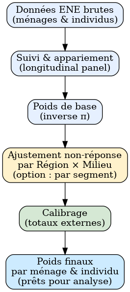

# 📝 RUWTHS : R Unified Weighting Treatment Harmonized System

**RUWTHS** *(prononcé "Ruth's")* est un système modulaire développé en **R** pour le traitement harmonisé des pondérations dans les enquêtes statistiques.
Ce projet consiste en une refonte du dispositif de calcule des différentes types de pondérations dans le cadre de l'Enquête Nationale sur l'Emploi auprès des Ménages (ENE-M).
Il est en phase de test mais est déjà fortement stable. Il est écrit entièrement en R pour tirer avantage des solutions Open Source.


## 🧭 Objectifs

RUWTHS vise à :

- Unifier les étapes de pondération dans des enquêtes répétées ou longitudinales
- Standardiser le traitement des non-réponses, ajustements, calages et calibration (la calibration est réalisée à partir de **Rgenesees**)
- Produire des fichiers de pondérations robustes, traçables et reproductibles
- Générer automatiquement des diagnostics d'erreur et d'incohérences dans les données.


## 🎯 De manière spécifique, RUWTHS permet de : 

- Produire des **poids d’enquête fiables, traçables et reproductibles**.
- Gérer de façon unifiée :
  - les **poids de sondage de base**,
  - l’**ajustement pour non-réponse**,
  - le **calibrage** sur les totaux de population,
  - les **contrôles qualité et diagnostics**.
- Supporter à la fois les enquêtes **transversales** et les suivis **longitudinaux**.

## 📂 Structure du dépôt
```
enem_weight_nv/
│── config/ # Paramètres par trimestre, configuration du plan de sondage
│── data/ # Données brutes et pondérées (ménages, individus, fichiers par trimestre)
│── scripts/ # Scripts R pour chaque étape du processus de pondération
│── dashboard/ # Tableaux de bord Shiny de suivi des incohérences pouvant affecter les pondérations (diagnostics, visualisations)
│── logs/ # Journaux d’exécution (traçabilité)
│── README.md # Documentation du projet
```


## ⚙️ Méthodologie (niveau conceptuel)

### 1) Poids de base — `calc_base_weights.R`

Calcule les **poids de base** (inverse de la probabilité d’inclusion) :

}_{hi}=\frac{1}{\pi_{hi}})

**Idée** : \( \pi_{hi} \) est la probabilité de sélection de l’unité *i* dans la strate (ou segment) *h*; le poids de base est l’inverse de cette probabilité.


### 2) Suivi & appariement — `tracking.R`

- Gère le **suivi longitudinal** des ménages/individus réinterviewés entre trimestres.
- Harmonise les identifiants et ajoute la variable `finalnumtrimestre`.
- Produit un fichier prêt pour la pondération (maîtrise de la rotation/panel).


### 3) Ajustement pour non-réponse — `non_response.R`

- **Actuel** : ajustement calculé par **Région × Milieu (urbain/rural)**.  
- **Optionnel** : possibilité de revenir à une définition plus fine **par segment**.

Formule d’ajustement (par Région × Milieu) appliquée aux poids de base :

}_{i}=w^{(0)}_{i}\cdot\frac{N_{rm}}{R_{rm}})

où \(N_{rm}\) et \(R_{rm}\) sont respectivement le nombre d’unités **éligibles** et **répondantes** dans la **région** *r* et le **milieu** *m*.


### 4) Calibrage — `calibration.R`

Aligne les poids sur des **totaux externes** (benchmarks démographiques, ex. âge × sexe × région × milieu), typiquement via **Rgenesees**. On cherche des facteurs de calibration \(g(\cdot)\) tels que :

}_{i}x_{i}=X)

où \(X\) sont les totaux de contrôle. Les poids calibrés s’écrivent :

}_{i}=w^{(1)}_{i}\cdot%20g(x_i))

---

### 5) Contrôles qualité — `quality_checks.R`

- Absence de poids nuls/manquants; détection d’outliers (éventuel trimming).
- Cohérence **ménage ↔ individu** et checks de doublons.
- Comparaison distributions **pondérées vs non pondérées**.
- Génération de diagnostics (tableaux/graphes) dans `dashboard/` et de journaux dans `logs/`.

---

## 🔄 Schéma du flux de traitement

> Placez ce fichier image dans la racine du dépôt, puis référencez-le comme ci-dessous.



---

## 🛠 Technologies

- **R** : logique de pondération et calibration
- **Rgenesees** : moteur de calibrage
- **HTML** : tableaux de bord
- **Stata** : scripts complémentaires (préparation/validation)

---

## 📊 Résultats attendus

- Fichiers de poids **par trimestre** (ménages & individus).
- Diagnostics reproductibles dans `/dashboard` et `/logs`.
- Poids finaux utilisables directement pour l’analyse (emploi, chômage, sous-emploi, etc.).
