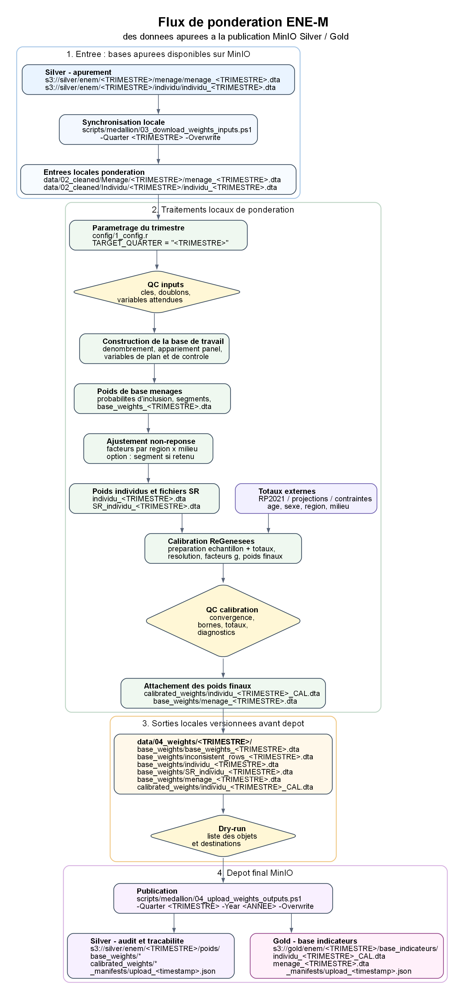

# 📝 RUWTHS : R Unified Weighting Treatment Harmonized System

**RUWTHS** *(prononcé "Ruth's")* est un système modulaire développé en **R** pour le traitement harmonisé des pondérations dans les enquêtes statistiques.
Ce projet consiste en une refonte du dispositif de calcule des différentes types de pondérations dans le cadre de l'Enquête Nationale sur l'Emploi auprès des Ménages (ENE-M).
Il est en phase de test mais est déjà fortement stable. Il est écrit entièrement en R pour tirer avantage des solutions Open Source.

## 🧭 Objectifs

RUWTHS vise à :

- Unifier les étapes de pondération dans des enquêtes répétées ou longitudinales
- Standardiser le traitement des non-réponses, ajustements, calages et calibration (la calibration est réalisée à partir de **Rgenesees**)
- Produire des fichiers de pondérations robustes, traçables et reproductibles
- Générer automatiquement des diagnostics d'erreur et d'incohérences dans les données.

## 🎯 De manière spécifique, RUWTHS permet de : 

- Produire des **poids d’enquête fiables, traçables et reproductibles**.
- Gérer de façon unifiée :
  - les **poids de sondage de base**,
  - l’**ajustement pour non-réponse**,
  - le **calibrage** sur les totaux de population,
  - les **contrôles qualité et diagnostics**.
- Supporter à la fois les enquêtes **transversales** et les suivis **longitudinaux**.

## 📂 Structure du dépôt
```
enem_weight_nv/
│── config/ # Paramètres par trimestre, configuration du plan de sondage
│── data/ # Données brutes et pondérées (ménages, individus, fichiers par trimestre)
│── scripts/ # Scripts R pour chaque étape du processus de pondération
│── dashboard/ # Tableaux de bord Shiny de suivi des incohérences pouvant affecter les pondérations (diagnostics, visualisations)
│── logs/ # Journaux d’exécution (traçabilité)
│── README.md # Documentation du projet
```

## ⚙️ Méthodologie (niveau conceptuel)

### 1) Poids de base — `calc_base_weights.R`

Calcule les **poids de base** (inverse de la probabilité d’inclusion) :

}_{hi}=\frac{1}{\pi_{hi}})

**Idée** : 
  est la probabilité de sélection de l’unité *i* dans la strate (ou segment) *h*; le poids de base est l’inverse de cette probabilité.

### 2) Suivi & appariement — `tracking.R`

- Gère le **suivi longitudinal** des ménages/individus réinterviewés entre trimestres.
- Harmonise les identifiants et ajoute la variable `finalnumtrimestre`.
- Produit un fichier prêt pour la pondération (maîtrise de la rotation/panel).

### 3) Ajustement pour non-réponse — `non_response.R`

- **Actuel** : ajustement calculé par **Région × Milieu (urbain/rural)**.  
- **Optionnel** : possibilité de revenir à une définition plus fine **par segment**.

Formule d’ajustement (par Région × Milieu) appliquée aux poids de base :

}_{i}=w^{(0)}_{i}\cdot\frac{N_{rm}}{R_{rm}})

où  et   sont respectivement le nombre d’unités **éligibles** et **répondantes** dans la **région** *r* et le **milieu** *m*.

### 4) Calibrage — `calibration.R`

Aligne les poids sur des **totaux externes** (benchmarks démographiques, ex. âge × sexe × région × milieu), typiquement via **Rgenesees**. On cherche des facteurs de calibration )
tels que :

}_{i}x_{i}=X)

où \(X\) sont les totaux de contrôle. Les poids calibrés s’écrivent :

}_{i}=w^{(1)}_{i}\cdot%20g(x_i))

### 5) Contrôles qualité — `quality_checks.R`

- Absence de poids nuls/manquants; détection d’outliers (éventuel trimming).
- Cohérence **ménage ↔ individu** et checks de doublons.
- Comparaison distributions **pondérées vs non pondérées**.
- Génération de diagnostics (tableaux/graphes) dans `dashboard/` et de journaux dans `logs/`.

## 🔄 Schéma du flux de traitement



Source modifiable : `reports/enem_weight_flow_minio.dot`.


## 🛠 Technologies

- **R** : logique de pondération et calibration
- **Rgenesees** : moteur de calibrage
- **R Shiny** : tableaux de bord
- **Stata** : scripts complémentaires (préparation/validation)

## 📊 Résultats attendus

- Fichiers de poids **par trimestre** (ménages & individus).
- Diagnostics reproductibles dans `/dashboard` et `/logs`.
- Poids finaux utilisables directement pour l’analyse (emploi, chômage, sous-emploi, etc.).

## Publication MinIO des sorties de pondération

Après validation de la calibration et des poids ménages finaux, les sorties de la
composante pondération sont publiées dans les buckets medallion MinIO (`silver` et
`gold`) avec le script d'orchestration intégré au dépôt.

### Commande standard

Depuis la racine du dépôt `ENE_SURVEY_WEIGHTS` :

```powershell
.\scripts\medallion\04_upload_weights_outputs.ps1 -Quarter T1_2026 -Year 2026 -DryRun
.\scripts\medallion\04_upload_weights_outputs.ps1 -Quarter T1_2026 -Year 2026 -Overwrite
```

Utiliser toujours `-DryRun` avant l'upload réel pour vérifier la liste exacte des
fichiers et des destinations. Utiliser `-Overwrite` uniquement quand les objets du
serveur doivent être remplacés par la version locale finalisée.

### Exécution via le serveur VPN de la direction

Si le poste est connecté au MinIO de la direction par VPN, forcer l'endpoint S3 du
serveur et neutraliser le proxy local pour cette session PowerShell :

```powershell
$env:MINIO_ENDPOINT = 'http://192.168.1.230:30137'
$env:NO_PROXY = 'localhost,127.0.0.1,::1,192.168.1.230'
$env:HTTP_PROXY = ''
$env:HTTPS_PROXY = ''
$env:ALL_PROXY = ''

python C:\Users\f.migone\Desktop\ENE_MEDALLION_ORCHESTRATION\ene_medallion_io\04_upload_weights_outputs.py `
  --quarter T1_2026 `
  --year 2026 `
  --base-dir C:\Users\f.migone\Desktop\ENE_SURVEY_WEIGHTS `
  --credentials-file C:\Users\f.migone\Desktop\ENE_SECRETS\ENE_SURVEY_WEIGHTS_credentials.json `
  --dry-run

python C:\Users\f.migone\Desktop\ENE_MEDALLION_ORCHESTRATION\ene_medallion_io\04_upload_weights_outputs.py `
  --quarter T1_2026 `
  --year 2026 `
  --base-dir C:\Users\f.migone\Desktop\ENE_SURVEY_WEIGHTS `
  --credentials-file C:\Users\f.migone\Desktop\ENE_SECRETS\ENE_SURVEY_WEIGHTS_credentials.json `
  --overwrite
```

Le fichier d'identifiants doit rester hors du dépôt. Ne jamais copier les clés
MinIO dans le README ou dans un script versionné.

### Structure locale attendue

Pour un trimestre `<TRIMESTRE>` tel que `T1_2026`, le script publie les fichiers
situés sous :

```text
data/04_weights/<TRIMESTRE>/
  base_weights/
    base_weights_<TRIMESTRE>.dta
    inconsistent_rows_<TRIMESTRE>.dta
    individu_<TRIMESTRE>.dta
    SR_individu_<TRIMESTRE>.dta
    menage_<TRIMESTRE>.dta
  calibrated_weights/
    individu_<TRIMESTRE>_CAL.dta
```

### Structure publiée sur MinIO

Le dossier complet `data/04_weights/<TRIMESTRE>` est publié dans `silver` :

```text
s3://silver/enem/<TRIMESTRE>/poids/base_weights/base_weights_<TRIMESTRE>.dta
s3://silver/enem/<TRIMESTRE>/poids/base_weights/inconsistent_rows_<TRIMESTRE>.dta
s3://silver/enem/<TRIMESTRE>/poids/base_weights/individu_<TRIMESTRE>.dta
s3://silver/enem/<TRIMESTRE>/poids/base_weights/SR_individu_<TRIMESTRE>.dta
s3://silver/enem/<TRIMESTRE>/poids/base_weights/menage_<TRIMESTRE>.dta
s3://silver/enem/<TRIMESTRE>/poids/calibrated_weights/individu_<TRIMESTRE>_CAL.dta
s3://silver/enem/<TRIMESTRE>/poids/_manifests/upload_<timestamp>.json
```

Les fichiers directement consommables par la composante indicateurs sont publiés
dans `gold` :

```text
s3://gold/enem/<TRIMESTRE>/base_indicateurs/individu_<TRIMESTRE>_CAL.dta
s3://gold/enem/<TRIMESTRE>/base_indicateurs/menage_<TRIMESTRE>.dta
s3://gold/enem/<TRIMESTRE>/base_indicateurs/_manifests/upload_<timestamp>.json
```

### Trace de publication T1_2026

Lors de la publication du `2026-06-06`, la version ménage envoyée était :

```text
Fichier : data/04_weights/T1_2026/base_weights/menage_T1_2026.dta
Taille  : 51,500,006 bytes
Date    : 2026-06-04 18:49:34 heure locale
SHA256  : 7A0896ECB12ABF18F9194D13FD806929F93DF08CA1D3B393A2C258434D73D999
```
