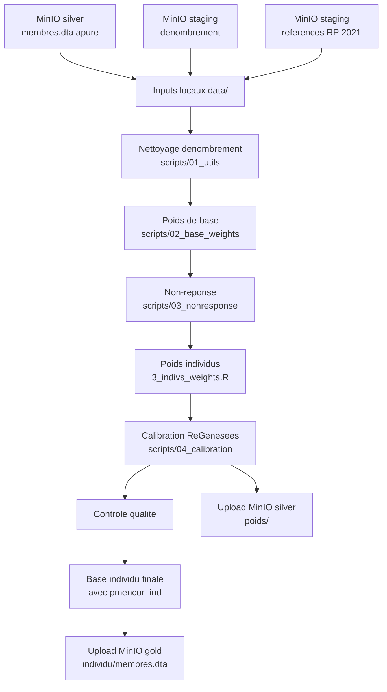

# Processus complet du projet ENE_SURVEY_WEIGHTS

Ce document decrit le role du projet `ENE_SURVEY_WEIGHTS` dans la chaine de production ENE-M, puis detaille le processus local de production des ponderations.

Le depot correspond principalement au projet de ponderation. Il recoit les donnees apurees produites en amont, calcule les poids d'enquete, applique les ajustements et le calage, puis produit les fichiers ponderes utilises par les tabulations et les bulletins.

## 1. Vue d'ensemble

La production ENE-M s'organise en trois grands projets successifs.


| Projet | Role | Sortie principale |
|---|---|---|
| Projet 1 - Apurement | Nettoyer, standardiser et codifier les donnees collectees. | Bases menage et individu apurees. |
| Projet 2 - Ponderation | Calculer les poids de base, ajuster la non-reponse, calibrer les poids et rattacher les poids finaux. | Base individu finale avec `pmencor_ind` et fichiers de poids. |
| Projet 3 - Tabulations | Produire les indicateurs, tableaux Excel et bulletins. | Tableaux d'indicateurs et bulletin trimestriel. |

Le stockage central est organise en couches de maturite : `staging`, `bronze`, `silver`, `gold`. Les scripts locaux telechargent les entrees depuis MinIO, produisent les sorties dans `data/`, puis les resultats valides peuvent etre renvoyes vers MinIO.

## 2. Role du depot

`ENE_SURVEY_WEIGHTS` prend en charge la ponderation trimestrielle et certains traitements associes :

- recuperation des inputs apures et des donnees de denombrement ;
- nettoyage et consolidation du denombrement ;
- preparation des variables necessaires au plan de sondage ;
- calcul des poids de base menage ;
- ajustement pour la non-reponse ;
- derivation des poids individus ;
- calibration avec ReGenesees selon une specification de calage ;
- controle qualite des poids ;
- rattachement des poids finaux aux donnees individuelles ;
- export des resultats vers la couche `gold` et des poids intermediaires vers `silver`.

## 3. Entrees attendues

Pour un trimestre donne, par exemple `T1_2026`, le projet attend principalement :

| Type d'entree | Emplacement local typique | Description |
|---|---|---|
| Donnees menage apurees | `data/02_cleaned/Menage/<TRIMESTRE>/menage_<TRIMESTRE>.dta` | Base menage issue de l'apurement. |
| Donnees individu apurees | `data/02_cleaned/Individu/<TRIMESTRE>/individu_<TRIMESTRE>.dta` | Base individu issue de l'apurement. |
| Denombrement brut | `data/01_raw/Denombrement/<TRIMESTRE>/` | Fichiers terrain ou exports de denombrement. |
| References population | `data/01_raw/RP_2021/` | Donnees de reference, notamment RP 2021 et projections. |
| Configuration | `config/1_config.r` | Trimestre cible, chemins et fonctions utilitaires. |

La variable centrale est `TARGET_QUARTER` dans `config/1_config.r`.

## 4. Synchronisation avec MinIO

La synchronisation est deleguee aux scripts PowerShell du dossier `scripts/medallion/`, qui appellent les outils Python de l'orchestration Medallion.

### Telechargement des inputs

```powershell
.\scripts\medallion\03_download_weights_inputs.ps1 -Quarter T1_2026 -Overwrite
```

Cette etape recupere les bases necessaires a la ponderation et les place dans l'arborescence locale `data/`.

### Upload des sorties

```powershell
.\scripts\medallion\04_upload_weights_outputs.ps1 -Period quarterly -Quarter T1_2026 -Year 2026 -Overwrite
```

Cette etape publie les resultats valides :

- les poids et fichiers intermediaires dans `silver/enem/<TRIMESTRE>/poids/` ;
- la base individu finale avec poids dans `gold/enem/<TRIMESTRE>/individu/`.

## 5. Processus local de ponderation

Le traitement doit etre lance depuis la racine du projet.

### 5.1 Preparation de l'environnement

Si les packages R ne sont pas deja disponibles :

```powershell
Rscript.exe scripts/00_setup/install_required_packages.R
```

Verifier ensuite dans `config/1_config.r` :

- `BASE_DIR` ;
- `TARGET_QUARTER` ;
- les chemins derives dans `PATHS` ;
- les noms de fichiers attendus dans `FILES`.

### 5.2 Preparation et nettoyage des donnees

Scripts principaux :

```text
scripts/01_utils/1_concat_denomb.R
scripts/01_utils/2_denomb_updates.R
scripts/01_utils/3_assign_firstTrim_interview.R
scripts/01_utils/4_gen_interviewkey_map.R
scripts/01_utils/5_delete_individu_age_sexe.r
```

Cette phase :

- consolide les fichiers de denombrement ;
- applique les corrections connues ;
- prepare les identifiants d'entretien ;
- gere les correspondances entre passages ou trimestres ;
- supprime ou corrige certains cas invalides pour la ponderation.

Sorties attendues :

- donnees de denombrement nettoyees ;
- mapping des interview keys ;
- bases menage et individu pretes pour les calculs de poids.

### 5.3 Calcul des poids de base

Scripts principaux :

```text
scripts/02_base_weights/1_gen_weights_columns.R
scripts/02_base_weights/2_calc_base_weights.R
```

Cette phase prepare les colonnes du plan de sondage, calcule les probabilites d'inclusion et produit les poids de base menage.

Principe :

```text
poids de base = 1 / probabilite d'inclusion
```

Sorties attendues :

- fichiers de poids de base dans `data/04_weights/<TRIMESTRE>/base_weights/` ;
- variables techniques necessaires aux etapes suivantes.

### 5.4 Ajustement pour non-reponse

Script principal :

```text
scripts/03_nonresponse/1_adjust_weights_non_response.R
```

Cette phase corrige les poids pour tenir compte des unites eligibles non repondantes. L'ajustement est applique sur des groupes de reponse, par exemple region et milieu selon la configuration et les donnees disponibles.

Sorties attendues :

- poids ajustes pour la non-reponse ;
- diagnostics ou logs de suivi.

### 5.5 Derivation des poids individuels

Script principal :

```text
scripts/02_base_weights/3_indivs_weights.R
```

Cette phase rattache ou derive les poids individuels a partir des poids menage ajustes et des donnees individuelles disponibles.

Sorties attendues :

- base individu avec poids avant calibration ;
- fichiers de poids individuels intermediaires.

### 5.6 Calibration trimestrielle

La calibration active repose sur les dossiers historiques par annee, trimestre et specification de calage :

```text
scripts/04_calibration/QUARTERLY_WEIGHTING/<ANNEE>/<TRIMESTRE>/<DESIGN>/
```

Exemple :

```text
scripts/04_calibration/QUARTERLY_WEIGHTING/2026/T1/180X_1D/
```

Chaque dossier contient generalement :

```text
00_Master_Calibration_<DESIGN>.R
01_Upload_Sample_Data_and_Known_Totals_in_R_<DESIGN>.R
02_Prepare_input_sample_data_for_regenesees_<DESIGN>.R
03_Prepare_input_pop_figures_for_regenesees_<DESIGN>.R
04c_Run_Quarterly_Calibration_with_Regenesees_<DESIGN>.R
04f_XFormats_<DESIGN>.R
05_Attach_final_weights_to_full_sample_data_<DESIGN>.R
```

Cette phase :

- charge l'echantillon et les totaux connus ;
- prepare les formats attendus par ReGenesees ;
- applique le calage sur marges ;
- controle la convergence et les ecarts aux totaux ;
- produit les poids calibres ;
- rattache le poids final a la base complete.

La variable finale attendue cote individu est `pmencor_ind`.

### 5.7 Poids menage finaux

Script principal :

```text
scripts/04_calibration/household_weights.r
```

Cette phase produit les poids menage finaux a partir des poids individuels calibres, selon la logique definie dans les scripts de calibration.

### 5.8 Controle qualite

Scripts et dossiers concernes :

```text
scripts/05_quality_control/
scripts/check_calibration.r
dashboard/
logs/
reports/
```

Les controles portent notamment sur :

- presence des poids attendus ;
- absence de poids nuls, manquants ou aberrants ;
- coherence entre bases menage et individu ;
- respect des totaux de calibration ;
- distribution des poids et coefficients de variation ;
- coherence des indicateurs produits avec les poids.

## 6. Flux de donnees simplifie



## 7. Sorties principales

| Sortie | Emplacement local typique | Destination MinIO |
|---|---|---|
| Denombrement nettoye | `data/02_cleaned/Denombrement/<TRIMESTRE>/` | `bronze/enem/<TRIMESTRE>/denombrement/` |
| Poids de base | `data/04_weights/<TRIMESTRE>/base_weights/` | `silver/enem/<TRIMESTRE>/poids/` |
| Poids calibres | `data/04_weights/<TRIMESTRE>/calibrated_weights/` | `silver/enem/<TRIMESTRE>/poids/` |
| Base individu finale | selon script d'attachement final | `gold/enem/<TRIMESTRE>/individu/membres.dta` |
| Diagnostics | `logs/`, `reports/`, `dashboard/` | selon publication choisie |

## 8. Criteres de succes

Un run trimestriel est considere comme termine lorsque :

- les scripts critiques se terminent sans erreur ;
- les inputs du trimestre cible sont bien ceux definis par `TARGET_QUARTER` ;
- les poids de base et poids calibres sont produits ;
- les diagnostics de calibration sont acceptables ;
- la variable finale `pmencor_ind` est presente dans la base individu ;
- les controles qualite ne signalent pas d'anomalie bloquante ;
- les sorties sont publiees dans les couches MinIO attendues.

## 9. Points d'attention

| Risque | Verification recommandee |
|---|---|
| Mauvais trimestre cible | Controler `TARGET_QUARTER` avant chaque run. |
| Input apurement incomplet | Verifier la presence des bases menage et individu dans `data/02_cleaned/`. |
| Denombrement non synchronise | Relancer le download Medallion et comparer les dates de fichiers. |
| Specification de calibration incorrecte | Confirmer le dossier `<DESIGN>` utilise avant execution du master. |
| Calibration non convergente | Lire les logs ReGenesees et les ecarts aux totaux connus. |
| Poids final absent | Verifier explicitement `pmencor_ind` avant upload `gold`. |
| Ecrasement de sorties | Utiliser `-DryRun` avant `-Overwrite` en cas de doute. |

## 10. Modules complementaires

Le depot contient aussi des modules qui ne sont pas toujours dans le chemin trimestriel standard :

- `scripts/08_yearly_weights/` : production de poids annuels ;
- `scripts/09_create_indicators/` : generation ou preparation d'indicateurs ;
- `scripts/10_data_management/` : gestion et export de donnees, notamment vers MinIO ;
- `scripts/11_modif_design/` : simulations et analyses de modification du plan de sondage ;
- `dashboard/` : applications de suivi et visualisation.

Ces modules doivent etre lus comme des extensions du pipeline principal, pas comme des etapes obligatoires de chaque production trimestrielle.

